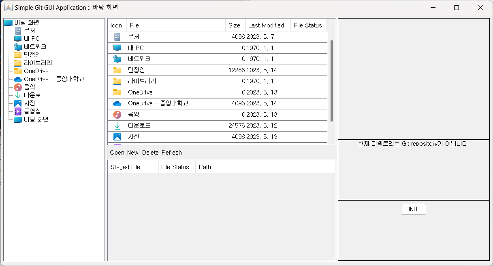
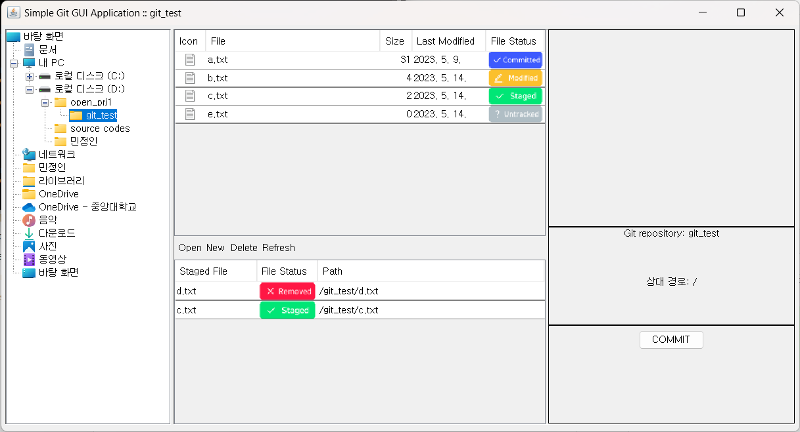
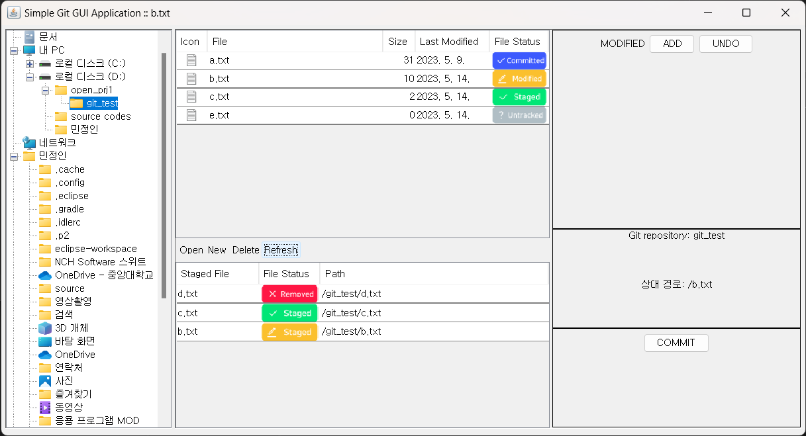
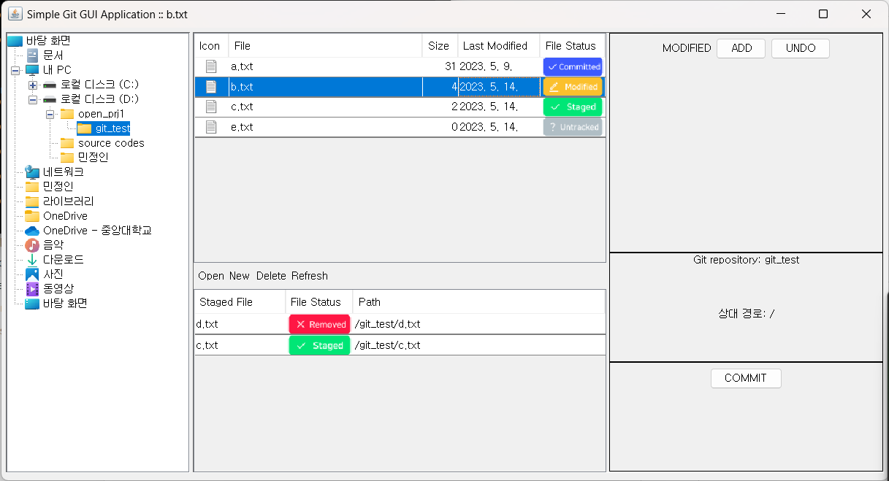
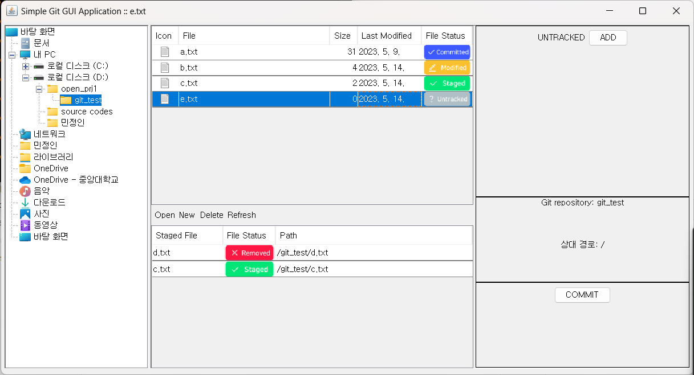
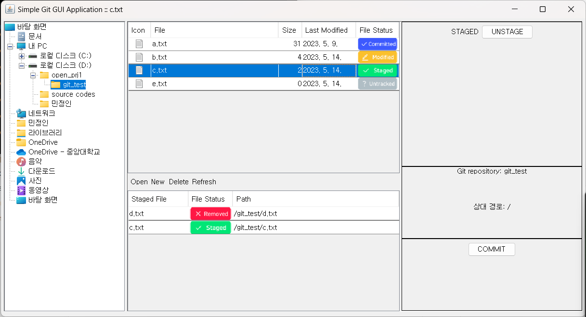
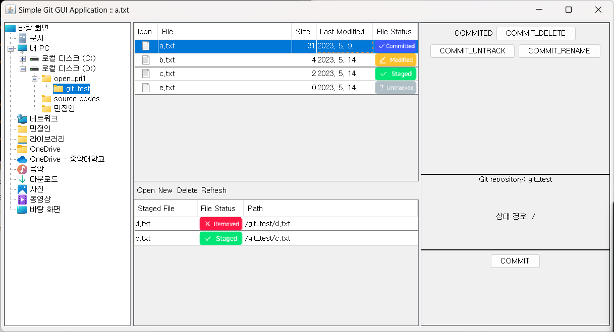
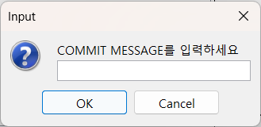

# README

# simple_git_gui

Simple-git-gui는 Git과 연동하여 파일을 탐색하는 GUI 파일브라우저입니다.

## 주요 특징

- 파일 탐색 기능 제공
- Git을 통한 파일 관리 기능 제공

## 지원 플랫폼

- Windows 10 x64 또는 그 이상

## 요구사항

- 자바 개발 키트(JDK) 설치
- 버전 17의 자바 런타임 환경(JRE) 설치

## 실행 방법

[https://github.com/bagzaru/simple_git_gui/releases/latest](https://github.com/bagzaru/simple_git_gui/releases/latest)

위의 링크에서 simple_git_gui-1.0-all.jar파일을 다운받습니다.

명령 프롬프트에서 파일의 위치로 이동합니다.

```bash
java -jar simple_git_gui-1.0-all.jar

```

위 명령어를 통해 simple_git_gui-1.0-all.jar을 실행합니다.
(자바 17버전에서 실행해야 합니다.)

## 파일 탐색 안내



[좌측 패널]

- 좌측 패널에서 파일과 디렉토리를 클릭을 통해 탐색할 수 있습니다.

[중앙 상단 패널]

- Current Directory에서는 현재 폴더 내의 파일과 폴더를 탐색할 수 있습니다.
- 각 파일의 Git status를 아이콘을 통해 확인할 수 있습니다.

[중앙 툴바]

- 파일의 실행, 생성, 삭제를 할 수 있습니다.
- Refresh 버튼을 누르면 파일 브라우저 외부에서 일어난 일들도 새로고침 할 수 있습니다.

[중앙 하단 패널]

- Staged List에서는 현재 Git에 staged된 파일 목록을 확인할 수 있습니다.

[우측 패널]

- Git repository가 아닐 경우, 해당 디렉토리를 Git repository로 만들 수 있습니다.

[우측 패널 - 파일 선택]

- Git repository일 경우, 선택된 파일을 Git 명령어를 통해 관리할 수 있습니다.

## Git을 통한 파일 관리 안내

파일을 선택하여 해당 파일을 Git을 통해 관리할 수 있습니다.

### 파일의 상태 - Directory



- Committed: 파일이 마지막 Commit의 상태와 동일함을 나타냅니다.
- Modified: 파일이 Git에서 관리하고 있는 내용과 다름을 의미합니다.
- Staged: 파일의 변경 사항이 Stage되었고, Staged 파일과 로컬 파일의 내용이 동일함을 의미합니다.
- Untracked: 파일이 Git에 의해 관리되고 있지 않음을 나타냅니다.

### 파일의 상태 - Staged List



Staged 상태인 파일들을 나타냅니다.

- Staged(Green): Staged 파일과 실제 존재하는 파일의 내용이 같습니다.
- Staged(Yellow): 파일이 Staged 상태이지만, 실제 로컬 저장소의 파일과 내용이 다릅니다. (수정, 삭제 등)
- Removed: git rm 등을 통해 파일이 삭제되었다는 내용이 Staged 된 상태입니다. (deleted)

### Git을 통한 버전 관리




- Add: 선택한 파일을 Staged List에 추가합니다.
- Undo: 선택한 파일을 마지막 Commit의 상태로 되돌립니다.



- Unstage: 선택한 파일을 Staged List에서 제거합니다. (파일의 내용은 변경되지 않습니다.)



- Untrack: 파일을 Untracked모드로 변경합니다.
- Delete: 파일을 삭제하고 Git에 반영합니다.
- Rename: 파일의 이름을 변경하고 Git에 반영합니다.



- Commit: 현재 Staged List의 내용을 Git에 Commit합니다.
