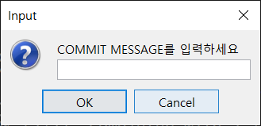

# simple_git_gui


Simple-git-gui는 Git과 연동하여 파일을 탐색하는 GUI 파일브라우저입니다.

## 주요 특징

- 파일 탐색 기능 제공
- Git을 통한 파일 관리 기능 제공
- 브랜치 관리 기능 제공
- 커밋에 대한 정보 확인

## 지원 플랫폼

- Windows 10 x64 또는 그 이상

## 요구사항

- 자바 개발 키트(JDK) 17 설치
- 버전 17의 자바 런타임 환경(JRE) 설치
- Git 설치

## 실행 방법

[https://github.com/bagzaru/simple_git_gui/releases/latest](https://github.com/bagzaru/simple_git_gui/releases/latest)

위의 링크에서 simple_git_gui-2.0-all.jar 파일과 credentials.txt 을 다운받습니다. 두 파일은 같은 폴더에 위치해야 합니다.

명령 프롬프트에서 파일의 위치로 이동합니다.

```bash
java -jar simple_git_gui-2.0-all.jar

```

위 명령어를 통해 simple_git_gui-2.0-all.jar을 실행합니다.
(자바 17버전에서 실행해야 합니다.)

## 모드 설정

### 상단 툴바
- 파일 매니저 / 브랜치 매니저 / 로그인 중 선택할 수 있습니다.

## 파일 탐색 안내 (파일 매니저)


### 좌측 패널

- 좌측 패널에서 파일과 디렉토리를 클릭을 통해 탐색할 수 있습니다.

### 중앙 상단 패널(Directory)

- Current Directory에서는 현재 폴더 내의 파일과 폴더를 탐색할 수 있습니다.
- 각 파일의 Git status를 아이콘을 통해 확인할 수 있습니다.

### 중앙 툴바

- 파일의 실행, 생성, 삭제를 할 수 있습니다.
- StageAll 버튼을 누르면 현재 Git Repository의 변경사항을 모두 Stage할 수 있습니다. (git add .)
- Refresh 버튼을 누르면 파일 브라우저 외부에서 일어난 일들도 새로고침 할 수 있습니다.

### 중앙 하단 패널(Staged List)

- Staged List에서는 현재 Git에 staged된 파일 목록을 확인할 수 있습니다.

### 우측 패널

- Git repository가 아닐 경우, 해당 디렉토리를 Git repository로 만들 수 있습니다.

### 우측 패널 - 파일 선택

- Git repository일 경우, 선택된 파일을 Git 명령어를 통해 관리할 수 있습니다.

## Git을 통한 파일 관리 안내 (파일 매니저)

파일을 선택하여 해당 파일을 Git을 통해 관리할 수 있습니다.

### 파일의 상태 - Directory


중앙 상단의 테이블에서 파일의 상태를 볼 수 있습니다.
우측 상단의 패널로 각 상태에 맞는 명령을 실행할 수 있습니다.

- Committed: 파일이 마지막 Commit의 상태와 동일함을 나타냅니다.
- Modified: 파일이 Git에서 관리하고 있는 내용과 다름을 의미합니다.
- Staged: 파일의 변경 사항이 Stage되었고, Staged 파일과 로컬 파일의 내용이 동일함을 의미합니다.
- Untracked: 파일이 Git에 의해 관리되고 있지 않음을 나타냅니다.

### 파일의 상태 - Staged List


중앙 하단 테이블에서는 Staged 상태인 파일들을 나타냅니다.
더블클릭으로 Staged 상태인 파일은 Unstage할 수 있습니다.

- Added: 파일이 Git에 새로 추가되어 Stage되었습니다.
- Staged: 파일이 이전 Commit에서 수정되어 Stage되었습니다.
- Deleted: git rm 등을 통해 파일이 삭제되었다는 내용이 Staged 된 상태입니다.

### Git을 통한 버전 관리


[Untracked]

- Add: 선택한 파일을 Staged List에 추가합니다.


[Modified]

- Add: 선택한 파일을 Staged List에 추가합니다.
- Undo: 선택한 파일을 마지막 Commit의 상태로 되돌립니다.


[Staged]

- Unstage: 선택한 파일을 Staged List에서 제거합니다. (파일의 내용은 변경되지 않습니다.)


[Committed]

- Delete: 파일을 삭제하고 Git에 반영합니다.
- Untrack: 파일을 Untracked모드로 변경합니다.
- Rename: 파일의 이름을 변경하고 Git에 반영합니다.

### Commit



- Commit: 현재 Staged List의 내용을 Git에 Commit합니다.

### Clone

{사진}

- 저장되어있는 ID와 Access Token과 입력한 URL을 가지고 현재 디렉토리에 clone을 합니다.

## 브랜치 / 커밋 관리 안내 (브랜치 매니저)

{사진}

### 좌측 상단 버튼

{사진}

- [+] 브랜치를 추가합니다.
- [-] 클릭한 브랜치를 삭제합니다.
- [R] 클릭한 브랜치의 이름을 변경합니다.
- [M] 현재 브랜치에 클릭한 브랜치를 merge합니다. 충돌이 날 경우 오류 메시지를 출력합니다.

### 좌측 중앙 패널

{사진}

- Git repository의 전체 브랜치를 나타냅니다. 
- 체크아웃 되어있는 브랜치 좌측에는 체크를 표시합니다.
- 브랜치를 한번 클릭하면 브랜치에 대한 로그가 우측 상단 패널에 표시됩니다.
- 브랜치를 더블클릭하면 그 브랜치로 체크아웃합니다.

### 좌측 하단 패널

{사진}

- 체크아웃 되어있는 브랜치의 이름을 출력합니다
- 브랜치 리스트 (좌측 중앙 패널)에서 클릭한 브랜치의 이름을 출력합니다.

### 우측 상단 패널

{사진}

- 커밋 로그에 대한 그래프를 출력합니다.
- 커밋 메시지, Author, 체크썸을 출력합니다.
- 커밋을 클릭하면 중앙 하단 패널에 커밋에 대한 정보를 출력합니다.

### 중앙 하단 패널

{사진}

상단 패널
- 우측 상단 패널에서 클릭한 커밋의 정보를 출력합니다.
- 체크썸, 커밋 시간, 커밋 메시지, Author 이름, Author E-mail을 출력합니다.

하단 패널
- 현재 커밋에서 변경된 파일의 리스트를 출력합니다.
- 파일을 선택할 경우 변경사항을 출력합니다.

### 우측 하단 패널

{사진}

- 선택한 파일의 변경 내용을 출력합니다.

## 로그인 안내

{사진}

- 미리 저장되어있는 ID와 Token값을 출력합니다.
- 사전에 정보를 등록한 적이 없다면 빈 문자열을 출력합니다.
- Log In 버튼을 누르면 입력(수정)한 ID와 Token값을 저장합니다.